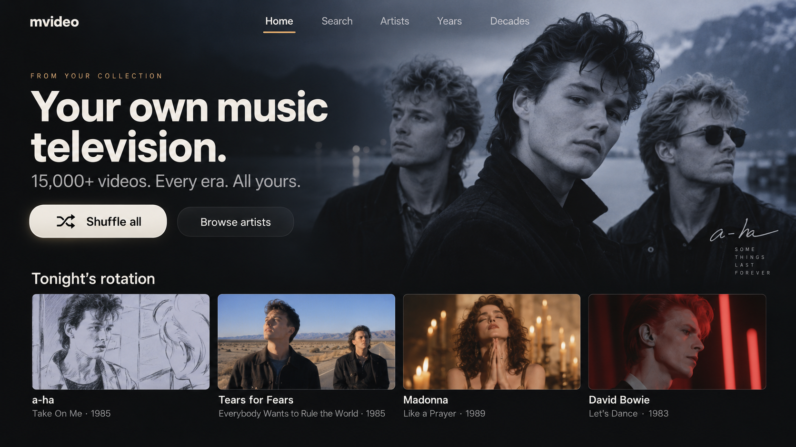
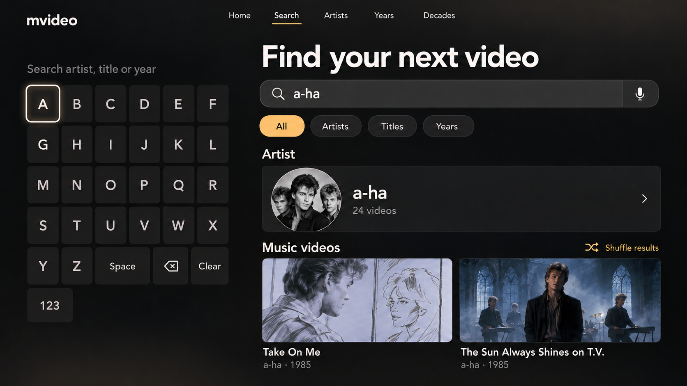
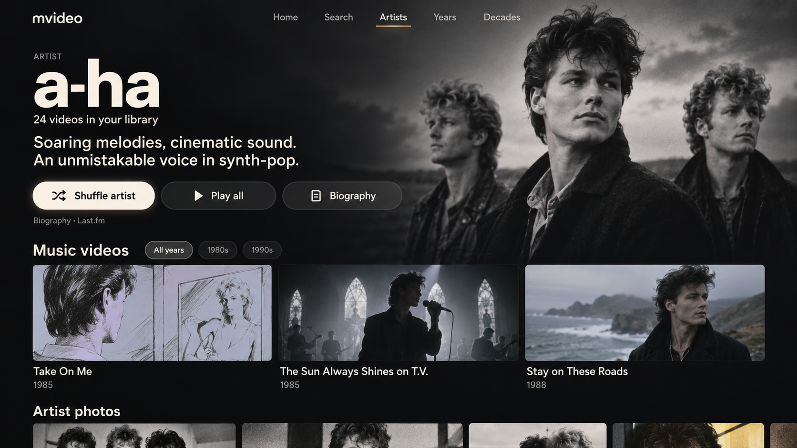
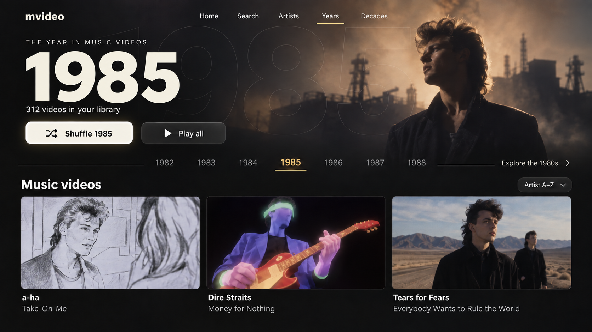
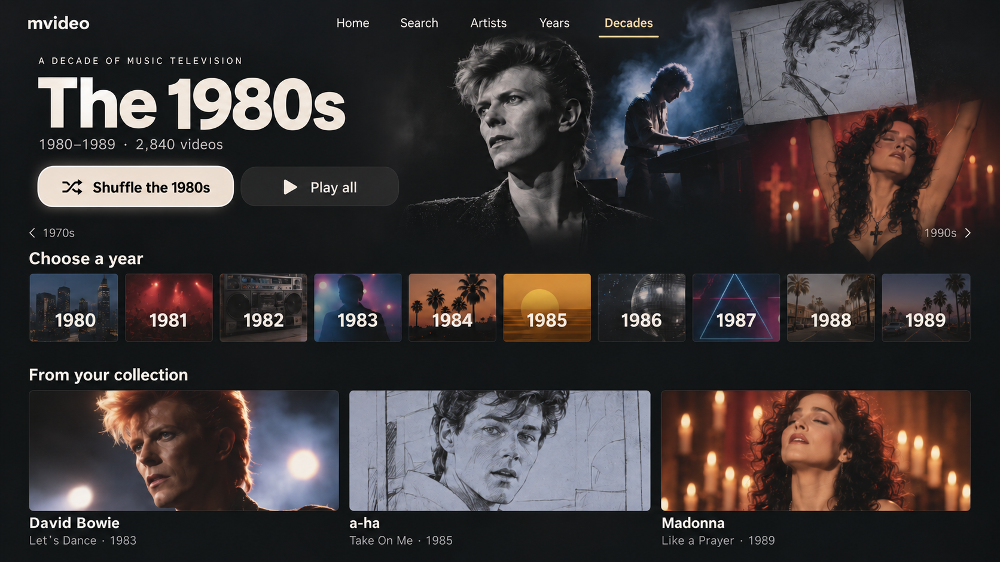

# Apple TV visual concept review

Created 2026-10-01 with the built-in imagegen tool. This is one coordinated visual direction across five screens, approved by the owner for native tvOS implementation on 2026-10-01.

## Direction

Cinematic charcoal backgrounds let video imagery provide color. Large warm-white type and generous spacing support sofa-distance reading. Amber marks the active section; a bright outline and elevated surface show remote focus. Focus treatments, exact safe areas, text sizing and motion will need validation on a real TV. Minor generated differences in corner radii are not intended as separate component styles.

These images show examples from the 1980s, not a restriction on the collection. Video counts, clips, photos and biography text are illustrative, including the displayed Last.fm attribution. Final provider text and source attribution must come from the actual metadata response. Artist likenesses and clip scenes are generated reference imagery, not final production assets.

## 1. Home

A library-wide invitation to start watching, a prominent **Shuffle all** action, artist browsing and a row of videos from the collection. The hero imagery can eventually draw from the owner's collection.

## 2. Search

Search by artist, title or year. A TV keyboard, numeric keyboard toggle, result-type filters, artist result and video thumbnails demonstrate the flow. **Shuffle results** is limited to the current matching videos.

The keyboard and microphone are visual placeholders for the intended input experience. Final text input should be designed around the platform's supported input methods. Punctuation, international characters, numeric input and returning from results to typing must be covered during implementation.

## 3. Artist

A photo-led artist page with a short introduction, a full **Biography** entry point, **Shuffle artist**, **Play all**, local video thumbnails and an artist photo strip below. The partial photo strip intentionally signals more content when scrolling.

## 4. Year

A clear year identity, local video count, **Shuffle 1985**, adjacent-year navigation, a route to the parent decade and video browsing. The year rail is a window into adjacent years rather than the complete set of available years.

## 5. Decade

A decade identity, **Shuffle the 1980s**, a complete 1980-1989 year chooser, adjacent-decade navigation and videos from the selected decade. The highlighted 1985 tile is illustrative; the prominent shuffle button holds remote focus in this scene.

## Intended playback behavior for discussion

- Selecting a video opens playback for that video.
- Shuffle starts a random video and continues within the chosen scope; a proposed refinement is to avoid repeats until that pool is exhausted.
- Artist/year/decade **Play all** actions build a queue from that page's collection. Exact ordering is to be decided during planning.
- Returning from playback should restore the previous page, focused item and scroll position.

These are proposed interactions; no behavior has been implemented or tested. The player, empty states, missing artwork, unavailable server and long-loading states belong in the next design/planning pass.

## Review and next step

Approve this visual direction or request changes to its palette, density, imagery or navigation. The next phase is an implementation plan that verifies media compatibility, Tailscale connectivity, provider matching and native tvOS interaction before coding on the Mac. The owner has approved this direction; implementation follows `../implementation/PLAN.md`.

The five PNGs are the saved review deliverables. [PROMPTS.md](PROMPTS.md) records the initial prompts and subsequent targeted edits. The generated images were visually inspected for page coverage, readable labels, search number input, chronological year tiles and correctly scoped shuffle actions. This is visual inspection, not device or usability testing.
